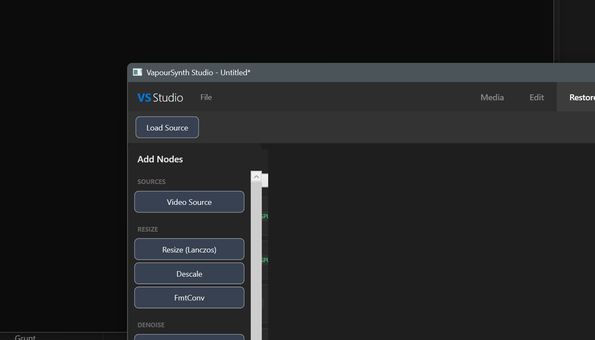

# VapourSynth Studio

A DaVinci Resolve-style video processing application built with WPF/.NET 8, featuring timeline editing, professional color grading, AI-powered restoration, and VapourSynth integration.

[](https://github.com/Atomic-Trash/vapoursynth-gui/releases)
[](https://github.com/Atomic-Trash/vapoursynth-gui/actions)


## Screenshots

### Edit Page - Timeline Editing


### Color Page - Professional Grading


### Restore Page - AI Processing


## Features

### Timeline Editor (Edit Page)
- **Multi-track timeline** with video and audio tracks
- **Text overlays/titles** with font styling, shadows, and animations
- **Clip operations** - cut, trim, split, delete, duplicate
- **Transitions** - cross dissolve, fade, wipe, slide, push
- **Drag & drop** media import
- **Undo/Redo** with full history support
- **Keyboard shortcuts** for efficient editing

### Color Grading (Color Page)
- **Color wheels** - Lift, Gamma, Gain controls
- **Curves editor** - RGB and individual channel curves
- **Video scopes** - Waveform, Vectorscope, Histogram, Parade
- **LUT support** - Load .cube and .3dl files
- **LUT browser** with search and favorites
- **A/B comparison** - Side-by-side, vertical split, and wipe modes
- **Preset library** with categorized looks
- **Export grades** as VapourSynth scripts or JSON

### AI Restoration (Restore Page)
- **Simple mode** - One-click presets for common tasks
- **Advanced mode** - Full node-based editor
- **Integrated filters**:
  - Denoising (BM3D, KNLMeansCL, DFTTest)
  - Upscaling (NNEDI3, Real-ESRGAN ready)
  - Deinterlacing (EEDI3, NNEDI3)
  - Frame interpolation (MVTools, RIFE ready)

### Media Management (Media Page)
- **Media browser** with thumbnails
- **Bin organization** for project assets
- **Metadata display** - resolution, codec, duration, frame rate
- **Proxy generation** for smooth editing

### Export (Export Page)
- **Format presets** - H.264, H.265/HEVC, ProRes, VP9, AV1
- **Quality controls** - CRF, bitrate, 2-pass encoding
- **Resolution scaling** with aspect ratio lock
- **Batch export queue** with progress tracking
- **FFmpeg integration** for broad format support

## Installation

### Prerequisites
- Windows 10/11 (x64)
- [.NET 8 SDK](https://dotnet.microsoft.com/download/dotnet/8.0)
- [Visual C++ Redistributable](https://aka.ms/vs/17/release/vc_redist.x64.exe)
- Optional: [mpv/libmpv](https://mpv.io/) for video playback

### Build & Run

```powershell
# Clone the repository
git clone https://github.com/Atomic-Trash/vapoursynth-gui.git
cd vapoursynth-gui

# Build and run the GUI
cd src/gui/VapourSynthPortable
dotnet run
```

### Build Portable Distribution

```powershell
# Build VapourSynth + plugins distribution
.\scripts\build\Build-Portable.ps1 -PluginSet standard

# Run the application
cd src/gui/VapourSynthPortable
dotnet run
```

## Keyboard Shortcuts

### Edit Page
| Shortcut | Action |
|----------|--------|
| `Space` | Play/Pause |
| `J` / `K` / `L` | Reverse / Pause / Forward |
| `I` / `O` | Set In/Out points |
| `S` | Split clip at playhead |
| `Delete` | Delete selected clip |
| `T` | Add text overlay |
| `Ctrl+Z` / `Ctrl+Y` | Undo / Redo |
| `←` / `→` | Step backward/forward |
| `Home` / `End` | Go to start/end |

### Color Page
| Shortcut | Action |
|----------|--------|
| `C` | Toggle A/B comparison |
| `R` | Reset all adjustments |
| `Ctrl+Z` / `Ctrl+Y` | Undo / Redo |

## Project Structure

```
vapoursynth-gui/
├── src/gui/VapourSynthPortable/
│   ├── Controls/           # Custom WPF controls
│   │   ├── TimelineControl     # Multi-track timeline
│   │   ├── ColorWheelControl   # Lift/Gamma/Gain wheels
│   │   ├── CurvesControl       # RGB curves editor
│   │   ├── ScopesControl       # Video scopes
│   │   └── VideoPlayerControl  # mpv-based player
│   ├── Pages/              # Application pages
│   │   ├── MediaPage       # Media browser
│   │   ├── EditPage        # Timeline editor
│   │   ├── RestorePage     # AI restoration
│   │   ├── ColorPage       # Color grading
│   │   └── ExportPage      # Export queue
│   ├── ViewModels/         # MVVM view models
│   ├── Models/             # Data models
│   └── Services/           # Backend services
├── scripts/                # All scripts organized by purpose
│   ├── build/              # Build & update scripts
│   ├── util/               # Utility & launcher scripts
│   ├── screenshots/        # Screenshot automation
│   └── test/               # Test scripts
├── templates/              # VapourSynth script templates
└── plugins.json            # Plugin definitions
```

## Tech Stack

- **Framework**: .NET 8, WPF
- **MVVM**: CommunityToolkit.Mvvm
- **Video Processing**: VapourSynth, FFmpeg
- **Playback**: libmpv (optional)
- **AI Models**: Real-ESRGAN, RIFE (planned)

## Configuration

### Adding LUTs
Place `.cube` or `.3dl` files in:
- `<app>/luts/` folder
- `Documents/LUTs/` folder

### VapourSynth Plugins
Edit `plugins.json` to add custom plugins:

```json
{
  "name": "myplugin",
  "description": "My custom plugin",
  "set": "standard",
  "url": "https://github.com/.../plugin.zip",
  "version": "1.0",
  "files": ["myplugin.dll"]
}
```

## Roadmap

- [ ] Real-time video preview with mpv
- [ ] AI upscaling integration (Real-ESRGAN)
- [ ] Frame interpolation (RIFE)
- [ ] Audio waveform display
- [ ] Keyframe animation
- [ ] Project auto-save
- [ ] Plugin marketplace

## Contributing

Contributions are welcome! Please feel free to submit issues and pull requests.

1. Fork the repository
2. Create a feature branch (`git checkout -b feature/amazing-feature`)
3. Commit your changes (`git commit -m 'Add amazing feature'`)
4. Push to the branch (`git push origin feature/amazing-feature`)
5. Open a Pull Request

## License

This project is licensed under the MIT License - see the [LICENSE](LICENSE) file for details.

### Third-Party Licenses
- VapourSynth: LGPL
- FFmpeg: LGPL/GPL
- mpv: GPL
- Individual plugins have their own licenses

## Acknowledgments

- [VapourSynth](https://github.com/vapoursynth/vapoursynth) - Video processing framework
- [FFmpeg](https://ffmpeg.org/) - Media encoding/decoding
- [mpv](https://mpv.io/) - Video playback
- [CommunityToolkit.Mvvm](https://github.com/CommunityToolkit/dotnet) - MVVM framework

## Resources

- [VapourSynth Documentation](http://www.vapoursynth.com/doc/)
- [VapourSynth Plugin Database](https://vsdb.top/)
- [FFmpeg Documentation](https://ffmpeg.org/documentation.html)
